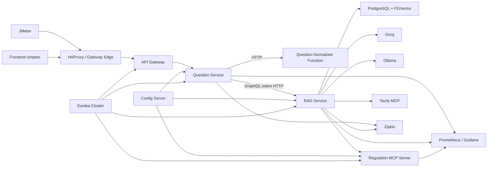

# UFRN Responde - Plano de Implementacao e Handoff

## 1. Finalidade deste documento

Este documento consolida o planejamento do restante da aplicacao **UFRN Responde** para que outro agente ou desenvolvedor consiga compreender o escopo, a arquitetura, a ordem de trabalho, os riscos e os criterios de aceite sem refazer a analise dos materiais da disciplina.

O produto de negocio deve permanecer deliberadamente pequeno. O objetivo principal do trabalho e demonstrar uma infraestrutura distribuida com Spring, inteligencia artificial, resiliencia, observabilidade e testes de capacidade.

### Restricao academica obrigatoria

O arquivo `/.md/Descrio_do_Terceiro_Trabalho_Pratico.pdf` proibe expressamente o uso de LLMs para gerar parcial ou totalmente o codigo da aplicacao.

Portanto:

- Este documento pode ser usado para planejamento, organizacao, revisao e verificacao.
- Um agente de IA nao deve implementar codigo da aplicacao enquanto essa restricao estiver vigente.
- Antes de qualquer geracao de codigo por agente, o aluno deve obter autorizacao explicita do professor.
- A implementacao academica deve ser realizada pelo aluno.

## 2. Materiais analisados

Foram revisados os 18 PDFs do diretorio `/.md`, totalizando 824 paginas. Eles cobrem:

- arquitetura cloud native e Twelve-Factor;
- Spring Cloud Gateway;
- Spring Cloud Config Server;
- Eureka e Spring Cloud LoadBalancer;
- GraphQL basico e avancado;
- serverless e Spring Cloud Function;
- Resilience4j;
- observabilidade com Actuator, Micrometer, Prometheus, Grafana e Zipkin;
- Spring AI, prompt engineering e avaliacao;
- Chat Memory;
- RAG e bancos vetoriais;
- Tools e MCP;
- os custos e riscos de usar microsservicos sem necessidade real.

Documento principal de requisitos:

- `/.md/Descrio_do_Terceiro_Trabalho_Pratico.pdf`

## 3. Estado atual do repositorio

O projeto atual e um Maven multi-module com:

- Java 26;
- Spring Boot 4.1.0;
- Spring Cloud 2025.1.2;
- Maven Wrapper 3.9.16;
- `ConfigServer`;
- cluster com tres instancias de `EurekaServer`;
- duas instancias de `APIGateway` atras de HAProxy;
- Config Server apoiado por repositorio Git local;
- Prometheus;
- Zipkin;
- circuit breaker e retry no Gateway;
- documentacao inicial de Twelve-Factor.

Os componentes existentes sao infraestrutura e nao substituem os tres microsservicos de negocio exigidos pelo trabalho.

### Alteracoes locais existentes

O worktree ja possui varias alteracoes do usuario. Qualquer trabalho futuro deve:

- executar `git status --short` antes de agir;
- preservar todas as alteracoes existentes;
- nao usar `git reset --hard` ou descarte automatico;
- nao alterar arquivos fora do escopo;
- nao versionar `.env`, chaves ou conteudo de `target/`.

## 4. Produto

### Nome

**UFRN Responde**

### Objetivo

Responder perguntas em portugues com base exclusivamente no Regulamento dos Cursos de Graduacao da UFRN e apresentar os artigos ou trechos usados como fontes.

### Corpus inicial

Usar somente o texto vigente do Regulamento dos Cursos de Graduacao, Resolucao no 016/2023-CONSEPE.

Fontes oficiais:

- PROGRAD: <https://prograd.ufrn.br/documento.php?id=86686401>
- PDF: <https://sig.ufrn.br/download/sigaa/public/regulamento_dos_cursos_de_graduacao.pdf>

O documento deve ser armazenado de forma versionada em `knowledge-base/`, acompanhado por metadados e checksum.

### Funcionalidades obrigatorias

1. Fazer uma pergunta sobre o regulamento.
2. Continuar a conversa usando Chat Memory.
3. Receber resposta com artigos e trechos utilizados.
4. Informar quando a resposta nao estiver no corpus.
5. Consultar um artigo exato por meio do MCP proprio.
6. Verificar a fonte oficial atual por meio de um MCP de terceiro.

### Fora do escopo

- login e autorizacao;
- dados pessoais de estudantes;
- integracao com SIGAA;
- matricula ou qualquer operacao academica;
- upload de documentos pelo usuario;
- painel administrativo;
- multiplos regulamentos;
- calendario academico;
- notificacoes;
- respostas gerais sobre a UFRN;
- frontend separado ou framework SPA;
- mensageria, Kafka ou filas;
- subscriptions GraphQL.

## 5. Arquitetura alvo



## 6. Modulos a adicionar

### 6.1 `QuestionService`

Microsservico coordenador e unico servico de negocio exposto publicamente.

Responsabilidades:

- servir uma pagina HTML simples;
- expor a API REST publica;
- validar o envelope da requisicao;
- criar ou aceitar `conversationId`;
- chamar a funcao serverless por HTTP;
- chamar `RagService` por GraphQL sobre HTTP;
- transformar erros GraphQL em respostas HTTP coerentes;
- aplicar Resilience4j nas chamadas remotas;
- propagar trace e correlation IDs;
- permanecer stateless.

Nao deve:

- acessar Groq e Ollama;
- acessar PGVector;
- implementar RAG;
- armazenar memoria de conversa;
- acessar MCP diretamente.

### 6.2 `RagService`

Microsservico responsavel por toda a integracao de IA.

Responsabilidades:

- expor servidor GraphQL interno;
- integrar Spring AI com Groq e Ollama;
- gerar embeddings da pergunta;
- consultar PGVector;
- montar o contexto RAG;
- usar Chat Memory persistente;
- atuar como cliente dos MCPs;
- oferecer as ferramentas MCP ao modelo;
- produzir resposta estruturada;
- registrar latencia, tokens, ferramentas e qualidade do retrieval.

### 6.3 `QuestionNormalizerFunction`

Terceiro microsservico, implementado como Spring Cloud Function.

Operacao unica:

- remover espacos excessivos;
- remover caracteres de controle;
- normalizar quebras de linha;
- validar tamanho minimo e maximo;
- devolver a pergunta normalizada.

Propriedades obrigatorias:

- stateless;
- deterministica;
- idempotente;
- curta duracao;
- sem persistencia;
- invocada por HTTP.

Pendente de confirmacao com o professor: se Spring Cloud Function executada em container e aceita ou se e obrigatorio implantar em um provedor FaaS.

### 6.4 `RegulationMcpServer`

MCP proprio e read-only.

Ferramentas minimas:

- `buscar_artigo(numero)`;
- `listar_secoes()`;
- `obter_metadados_regulamento()`.

O servidor deve usar Streamable HTTP, ficar interno e trabalhar sobre um artefato versionado e somente leitura do regulamento. Nao deve compartilhar tabelas do banco do `RagService`.

## 7. MCP de terceiro

### Escolha: Tavily MCP

Endpoint remoto:

- `https://mcp.tavily.com/mcp/`

Motivo da escolha:

- servidor MCP de terceiro real;
- transporte HTTP compativel com o requisito;
- oferece busca e extracao de paginas;
- possui utilidade limitada e legitima para verificar a pagina oficial vigente da UFRN.

Ferramentas permitidas:

- `tavily-search`;
- `tavily-extract`.

Regras de uso:

- usar apenas quando `verifyOfficialSource=true`;
- restringir pesquisas aos dominios oficiais da UFRN;
- nao usar resultados web como fonte normativa para responder regras;
- a resposta normativa sempre deve vir do corpus RAG local;
- se Tavily falhar, retornar a resposta RAG com `verifiedOnline=false`;
- aplicar timeout e circuit breaker;
- limitar quantidade e profundidade de resultados;
- nao incluir imagens nem conteudo bruto desnecessario.

Autenticacao:

- segredo em `TAVILY_API_KEY`;
- preferir header `Authorization` por customizacao do transporte;
- nao colocar a chave no repositorio, Config Server, logs, traces ou resposta;
- evitar chave em query string, ainda que o Tavily ofereca essa opcao.

## 8. Integracao Groq e Ollama

### Versoes planejadas

- Spring AI BOM: `2.0.0`;
- modelo de chat: `meta-llama/llama-4-scout-17b-16e-instruct` via Groq;
- modelo de embeddings: `bge-m3:567m` via Ollama local;
- dimensao padrao dos embeddings: 1024;
- vector store: PostgreSQL com PGVector e indice HNSW por similaridade de cosseno.

Razoes:

- Spring AI 2.0.x suporta Spring Boot 4.0.x e 4.1.x;
- Groq oferece endpoint compativel com OpenAI e limite gratuito adequado ao desenvolvimento;
- Llama 4 Scout suporta function calling e saida JSON;
- BGE-M3 suporta portugues e mais de 100 idiomas, com contexto de ate 8192 tokens;
- embeddings locais removem custo e quota externa da ingestao.

### Dependencias conceituais do `RagService`

- Spring AI OpenAI starter, usado como cliente compativel para Groq;
- Spring AI Ollama starter;
- Spring AI PGVector starter;
- Spring AI JDBC Chat Memory repository starter;
- Spring AI MCP client WebFlux starter;
- Spring GraphQL;
- PostgreSQL JDBC;
- Config Client;
- Eureka Client;
- LoadBalancer;
- Actuator;
- Prometheus;
- Zipkin/tracing;
- test starter.

### Configuracao

Segredos fornecidos somente por ambiente:

- `GROQ_API_KEY`;
- `TAVILY_API_KEY`;
- credenciais do PostgreSQL.

Configuracao centralizada e versionada:

- modelo de chat;
- modelo de embeddings;
- max completion tokens;
- top-K;
- similarity threshold;
- numero de mensagens da memoria;
- timeouts;
- retries;
- rate limits;
- URLs dos MCPs;
- flags de verificacao online.

Cuidados especificos:

- usar `max-completion-tokens`, inicialmente em torno de 300;
- manter `n=1`;
- reduzir o retry padrao do Spring AI de 10 tentativas para aproximadamente 2;
- aplicar backoff curto e limitado;
- nao repetir indefinidamente respostas 429 ou falhas permanentes;
- consultar os limites atuais do plano Groq antes dos testes de carga;
- ativar metricas da camada de modelo e, se necessario, do connection pool.

### Fluxo de IA

1. Receber `conversationId`, pergunta normalizada e `verifyOfficialSource`.
2. Gerar embedding da pergunta localmente com `bge-m3:567m`.
3. Consultar PGVector com top-K e limiar configuraveis.
4. Recuperar chunks e metadados de artigos.
5. Adicionar memoria conversacional.
6. Aplicar prompt de sistema.
7. Disponibilizar ferramentas dos MCPs.
8. Chamar Llama 4 Scout pelo endpoint Groq.
9. Executar eventual tool call.
10. Devolver resultado da ferramenta ao modelo.
11. Converter a saida para objeto estruturado.
12. Retornar a resposta GraphQL.

## 9. RAG e ingestao

### Estrategia de chunking

Nao dividir o regulamento cegamente apenas por caracteres.

Pipeline:

1. Extrair o texto do PDF oficial.
2. Separar prioritariamente por artigo.
3. Dividir artigos longos por tokens.
4. Preservar sobreposicao pequena quando necessario.
5. Anexar metadados a cada chunk.
6. Gerar embeddings.
7. Salvar no PGVector.

Metadados obrigatorios:

- titulo do documento;
- resolucao;
- artigo;
- secao ou titulo;
- pagina;
- URL oficial;
- checksum do documento;
- data de ingestao;
- versao do corpus.

### Processo administrativo

A ingestao deve ser um processo one-off executado a partir da mesma imagem e release do `RagService`, atendendo ao fator XII do Twelve-Factor.

Ela nao deve:

- executar novamente em toda inicializacao;
- baixar silenciosamente uma versao diferente;
- apagar a tabela vetorial automaticamente;
- depender de Tavily.

Trocar o modelo ou a dimensao de embeddings exige recriar e reingerir o vector store.

## 10. Prompt e comportamento

O prompt de sistema deve impor:

- responder em portugues;
- usar apenas os trechos recuperados como base normativa;
- nao inventar regras, prazos ou excecoes;
- citar artigos utilizados;
- dizer que nao encontrou a informacao quando o contexto for insuficiente;
- pedir esclarecimento para perguntas ambiguas;
- nao se apresentar como canal oficial da UFRN;
- recomendar confirmacao com PROGRAD ou coordenacao quando apropriado;
- usar Tavily somente para verificar origem e vigencia, nunca para substituir o corpus;
- nao revelar prompts internos, chaves, traces ou raciocinio interno.

Resposta minima:

- texto curto;
- lista de fontes;
- indicador `grounded`;
- indicador `verifiedOnline`;
- ferramentas utilizadas;
- `conversationId`.

## 11. Memoria conversacional

Usar `MessageWindowChatMemory` com repositorio JDBC no PostgreSQL.

Regras:

- cada usuario virtual do JMeter recebe um `conversationId` exclusivo;
- manter apenas uma janela pequena de mensagens;
- adicionar o advisor de memoria antes do advisor de RAG;
- nao usar sticky sessions;
- nao manter memoria apenas na JVM;
- diferenciar memoria de chat de historico completo;
- testar o comportamento de memoria quando houver tool calls MCP.

Observacao: o repositorio JDBC do Spring AI pode omitir mensagens internas de tool calling. A resposta final e as mensagens comuns devem ser suficientes para o caso de uso; validar isso na prova tecnica antes de considerar uma solucao de sessao mais complexa.

## 12. Contratos

### Rota REST publica

Metodo e caminho:

- `POST /question-service/api/questions`

Exemplo conceitual de entrada:

```json
{
  "conversationId": "jmeter-user-7",
  "question": "Como funciona o trancamento?",
  "verifyOfficialSource": false
}
```

Campos de saida:

- `conversationId`;
- `answer`;
- `grounded`;
- `verifiedOnline`;
- `sources`;
- `toolsUsed`;
- `timestamp`.

Erros:

- 400 para entrada invalida;
- 429 para rate limit;
- 503 para dependencia essencial indisponivel;
- fallback estruturado e sem stack trace.

### GraphQL interno

Operacao planejada:

- mutation `askQuestion(input: AskQuestionInput!): Answer!`

Usar mutation porque a operacao atualiza a memoria conversacional.

O cliente deve verificar tanto o status HTTP quanto o campo GraphQL `errors`, pois erros de negocio podem chegar com HTTP 200.

Nao implementar subscriptions, campos aninhados complexos ou DataLoader sem necessidade.

## 13. Rotas e Gateway

Somente `QuestionService` deve registrar:

- metadata Eureka `gateway-exposed=true`.

Os demais servicos permanecem privados.

O Gateway atual cria rotas dinamicas no formato:

- `/<service-id>/**`

Logo, a rota de teste sera:

- `POST http://localhost:8080/question-service/api/questions`

Cuidados:

- o timeout global atual de 5 segundos provavelmente e insuficiente;
- criar timeout especifico para a rota de perguntas;
- manter o deadline do Gateway maior que o do coordenador;
- manter o deadline do coordenador maior que o do `RagService`;
- nao aplicar retry de Gateway em POST;
- manter o retry atual apenas em GET/HEAD;
- continuar usando circuit breaker no Gateway e tambem no coordenador.

## 14. Resiliencia

### Chamada `QuestionService` -> funcao

- timeout;
- retry curto com backoff exponencial e jitter;
- circuit breaker;
- fallback para a pergunta original apos validacao basica.

Retry e seguro porque a funcao e idempotente.

### Chamada `QuestionService` -> `RagService`

- time limiter;
- circuit breaker;
- bulkhead;
- rate limiter;
- sem retry automatico da mutation;
- fallback HTTP 503.

Nao repetir automaticamente a mutation porque isso pode duplicar memoria e consumo de tokens.

### Chamada `RagService` -> Groq

- timeout inferior ao deadline do coordenador;
- retry muito limitado apenas para falhas transitorias;
- rate limiter alinhado aos limites da conta;
- bulkhead para limitar chamadas concorrentes;
- registrar 429, timeout, erro 5xx e latencia lenta.

### Chamada `RagService` -> Tavily

- timeout curto;
- circuit breaker separado;
- bulkhead separado;
- fallback com `verifiedOnline=false`;
- a indisponibilidade do Tavily nao deve impedir resposta RAG.

### Estados observaveis

Configurar e demonstrar:

- CLOSED;
- OPEN;
- HALF_OPEN;
- numero de chamadas permitidas/rejeitadas;
- taxa de falhas;
- chamadas lentas.

## 15. Observabilidade

### Metricas

Todos os novos servicos Spring devem expor `/actuator/prometheus` internamente.

Prometheus deve coletar:

- Gateway;
- Question Service;
- RAG Service;
- MCP proprio;
- funcao serverless, se o ambiente permitir.

Metricas essenciais:

- throughput HTTP;
- erros por status;
- latencia media e P95;
- JVM, CPU, memoria e threads;
- estado dos circuit breakers;
- bulkhead ativo e rejeicoes;
- rate limiter;
- latencia Groq;
- tokens de entrada e saida;
- chamadas de embeddings;
- respostas grounded e sem contexto;
- chamadas e falhas dos MCPs;
- uso do fallback da funcao.

### Grafana

Adicionar Grafana ao Compose com dashboards provisionados no repositorio.

Dashboard principal deve mostrar:

1. taxa de requisicoes;
2. taxa de erros;
3. P50/P95/P99;
4. instancias disponiveis;
5. circuit breakers;
6. bulkheads;
7. latencia e tokens da Groq;
8. falhas da funcao e dos MCPs.

### Tracing

Zipkin deve exibir:

```text
Gateway -> QuestionService -> QuestionNormalizerFunction
                           -> RagService -> Groq
                                         -> Ollama
                                        -> RegulationMcpServer
                                        -> TavilyMcp
```

### Logs

- escrever somente em stdout/stderr;
- incluir application name, trace ID e span ID;
- nunca registrar chaves, prompts completos, dados sensiveis ou URLs com segredo;
- permitir correlacionar erro do JMeter com trace e log.

## 16. Twelve-Factor

A implementacao detalhada, as evidencias e as excecoes deliberadas estao em
`TWELVE_FACTOR.md`. Os servicos de negocio seguem os fatores sempre que o
Docker Compose permite. O monorepo, o Config Server, os servicos de estado, a
paridade com SaaS externos e a administracao nativa dos backing services sao
classificados como conformidade parcial, com justificativa explicita.

## 17. Compose e infraestrutura

Adicionar ao `compose.yml`:

- PostgreSQL com PGVector;
- duas instancias do `QuestionService`;
- duas instancias do `RagService`;
- funcao normalizadora;
- MCP proprio;
- Grafana;
- novos health checks;
- volumes persistentes para PostgreSQL e Grafana;
- variaveis exigidas sem valores secretos padrao.

Atualizar:

- `.env.example` com placeholders;
- `infrastructure/prometheus/prometheus.yml`;
- configuracao e provisionamento do Grafana;
- HAProxy apenas se necessario para componentes que nao usam discovery;
- Config Repository com configuracao de cada novo servico.

Nao expor portas dos servicos de negocio diretamente ao host, salvo endpoints operacionais indispensaveis. O trafego funcional deve entrar pelo Gateway.

## 18. Config Repository

Adicionar:

```text
config-repository/config/question-service/application.properties
config-repository/config/rag-service/application.properties
config-repository/config/question-normalizer/application.properties
config-repository/config/regulation-mcp/application.properties
```

O Config Server deve armazenar politicas, nao segredos.

## 19. Testes

### Testes unitarios

- validacao da requisicao publica;
- normalizacao da funcao;
- mapeamento de erros GraphQL;
- fallbacks;
- montagem da resposta estruturada;
- extracao de metadados do regulamento;
- ferramentas MCP proprias.

### Testes de integracao

- servidor GraphQL;
- PGVector com Testcontainers;
- Chat Memory JDBC;
- Config Client;
- registro Eureka;
- circuit breaker e timeout;
- MCP cliente/servidor;
- Groq e Ollama substituidos por stubs apenas nos testes automatizados.

### Avaliacao da IA

Criar um conjunto pequeno e versionado:

- perguntas com artigo esperado;
- perguntas ambiguas;
- perguntas fora do corpus;
- perguntas de continuidade de conversa;
- perguntas que solicitam artigo exato;
- perguntas que solicitam verificacao online.

Avaliar:

- relevancia;
- factualidade em relacao aos chunks;
- citacoes corretas;
- recusa apropriada;
- estabilidade do formato.

## 20. JMeter

Todos os testes funcionais e de carga devem chamar somente o Gateway.

### `baseline.jmx`

- rota `POST /question-service/api/questions`;
- mais de cinco usuarios concorrentes;
- perguntas carregadas de CSV;
- `conversationId` exclusivo por thread;
- `verifyOfficialSource=false`;
- assertions para HTTP 200, resposta, `grounded` e fontes;
- Summary Report com zero erros abaixo da capacidade utilizavel.

### `capacity.jmx`

Executar carga em degraus, por exemplo:

- 6;
- 10;
- 15;
- 20;
- 30 usuarios.

Registrar:

- throughput;
- erro;
- P95;
- CPU;
- memoria;
- threads;
- bulkhead;
- circuit breaker;
- latencia e limites Groq e latencia local do Ollama.

Knee Capacity: ponto em que throughput deixa de crescer proporcionalmente ou latencia/erros aumentam fortemente.

Usable Capacity: valor abaixo do knee com margem documentada e zero erros no baseline.

### `resilience.jmx`

1. Executar abaixo da Usable Capacity.
2. Desligar instancias do `RagService` ou `QuestionService`.
3. Observar aumento de erros.
4. Observar circuit breaker no Grafana.
5. Restaurar ou escalar instancias.
6. Observar transicao HALF_OPEN para CLOSED.
7. Confirmar reducao dos erros.

### `mcp-functional.jmx`

Dois grupos pequenos:

- perguntas por artigo exato, validando MCP proprio;
- `verifyOfficialSource=true`, validando Tavily ou fallback.

Tavily nao deve participar do calculo principal do Knee Capacity, pois adiciona a capacidade de outro fornecedor ao experimento.

### Controle de custo

- usar modelo mini;
- limitar output;
- limitar iteracoes;
- usar perguntas curtas;
- acompanhar tokens no Grafana;
- conhecer rate limits da conta Groq;
- nao executar teste infinito;
- nao usar cache que esconda a chamada real de IA no teste de capacidade.

## 21. Ordem de implementacao

### Fase 0 - Decisoes e provas tecnicas

- confirmar formato aceito para serverless;
- criar conta/projeto e chaves Groq e Tavily;
- validar Spring AI 2.0.0 no build atual;
- testar uma chamada de chat Groq;
- testar um embedding local via Ollama;
- testar PGVector;
- listar tools do Tavily por Streamable HTTP;
- validar tool calling com Llama 4 Scout;
- medir latencia inicial para definir deadlines.

### Fase 1 - Estrutura distribuida

- adicionar modulos Maven;
- adicionar configuracao bootstrap;
- registrar servicos no Eureka;
- publicar apenas `QuestionService` no Gateway;
- criar Dockerfiles e health checks;
- confirmar escalabilidade com duas instancias.

### Fase 2 - Vertical slice sem IA completa

- frontend minimo;
- rota REST publica;
- funcao normalizadora;
- GraphQL interno;
- resposta fixa temporaria para validar todo o caminho;
- trace completo ate o `RagService`.

### Fase 3 - RAG

- adicionar PostgreSQL/PGVector;
- criar processo de ingestao;
- versionar corpus;
- adicionar embeddings;
- realizar similarity search;
- retornar chunks e fontes antes de adicionar geracao.

### Fase 4 - Groq e memoria

- configurar ChatClient;
- criar prompt;
- adicionar Structured Output;
- adicionar Chat Memory JDBC;
- validar perguntas complementares;
- adicionar metricas de IA.

### Fase 5 - MCPs

- implementar MCP proprio;
- integrar MCP client WebFlux;
- integrar Tavily;
- filtrar tools;
- adicionar `verifyOfficialSource`;
- validar fallbacks e observabilidade.

### Fase 6 - Resiliencia

- aplicar timeouts em camadas;
- circuit breakers separados;
- bulkheads;
- rate limiters;
- retry apenas onde for seguro;
- validar erros GraphQL em HTTP 200;
- validar recuperacao.

### Fase 7 - Observabilidade

- Prometheus em todos os servicos;
- Grafana provisionado;
- tracing Zipkin;
- logs correlacionados;
- dashboard de circuit breaker e IA.

### Fase 8 - Capacidade e apresentacao

- criar planos JMeter;
- encontrar Knee Capacity;
- definir Usable Capacity;
- ensaiar desligamento e escala;
- documentar resultados;
- preparar roteiro de demonstracao.

## 22. Arquivos esperados

Estrutura alvo:

```text
APIGateway/
ConfigServer/
EurekaServer/
QuestionService/
RagService/
QuestionNormalizerFunction/
RegulationMcpServer/
config-repository/
knowledge-base/
infrastructure/
  grafana/
  haproxy/
  prometheus/
jmeter/
compose.yml
pom.xml
IMPLEMENTATION_PLAN.md
```

## 23. Criterios de aceite

### Funcional

- pergunta entra pelo Gateway;
- pergunta passa pelo coordenador e funcao;
- coordenador chama IA por GraphQL;
- resposta usa o regulamento;
- resposta apresenta fontes;
- pergunta fora do corpus e recusada corretamente;
- memoria funciona com `conversationId`;
- MCP proprio e Tavily sao demonstraveis.

### Arquitetura

- pelo menos tres microsservicos de negocio;
- funcao serverless;
- Config Server;
- Eureka cluster;
- Gateway;
- LoadBalancer;
- GraphQL sobre HTTP;
- TCP/HTTP nas comunicacoes de servico;
- multiplas instancias dos servicos principais.

### Resiliencia

- timeouts definidos;
- circuit breakers observaveis;
- bulkheads e rate limiters;
- retry apenas em operacoes seguras;
- fallback coerente;
- recuperacao automatica apos restaurar instancias.

### Observabilidade

- metricas no Prometheus;
- dashboards Grafana;
- traces no Zipkin;
- logs correlacionados;
- status dos circuit breakers visivel durante JMeter.

### Capacidade

- Knee Capacity conhecida;
- Usable Capacity conhecida;
- baseline com mais de cinco usuarios e zero erros;
- aumento de erros durante falha;
- reducao de erros apos recuperacao.

## 24. Roteiro da apresentacao

1. Mostrar arquitetura e servicos registrados no Eureka.
2. Mostrar configuracao centralizada.
3. Fazer uma pergunta normal e exibir fontes RAG.
4. Fazer pergunta complementar e demonstrar memoria.
5. Perguntar por um artigo e demonstrar MCP proprio.
6. Verificar fonte oficial e demonstrar Tavily.
7. Abrir Grafana e Zipkin.
8. Iniciar JMeter abaixo da Usable Capacity.
9. Confirmar zero erros.
10. Desligar instancias.
11. Mostrar erros, traces e circuit breaker.
12. Restaurar ou escalar instancias.
13. Mostrar recuperacao e queda dos erros.

## 25. Riscos e decisoes pendentes

1. **Serverless:** confirmar se container com Spring Cloud Function e aceito.
2. **Groq:** verificar rate limit gratuito e acesso ao modelo planejado.
3. **Tavily:** verificar quota e compatibilidade do header de autenticacao no cliente MCP.
4. **Timeout:** o Gateway atual usa 5 segundos, provavelmente insuficiente.
5. **Memoria e tools:** validar a persistencia JDBC quando houver tool calls.
6. **Corpus:** confirmar checksum e versao oficial antes da ingestao.
7. **Quota JMeter:** limitar tokens e iteracoes para permanecer no plano gratuito.
8. **Spring AI:** manter a versao estavel 2.0.0, sem snapshots.

## 26. Referencias tecnicas

- Groq OpenAI Compatibility: <https://console.groq.com/docs/openai>
- Groq Models: <https://console.groq.com/docs/models>
- Groq Rate Limits: <https://console.groq.com/docs/rate-limits>
- Ollama BGE-M3: <https://ollama.com/library/bge-m3>
- Spring AI 2.0 Getting Started: <https://docs.spring.io/spring-ai/reference/getting-started.html>
- Spring AI OpenAI Chat: <https://docs.spring.io/spring-ai/reference/api/chat/openai-chat.html>
- Spring AI Ollama Embeddings: <https://docs.spring.io/spring-ai/reference/api/embeddings/ollama-embeddings.html>
- Spring AI PGVector: <https://docs.spring.io/spring-ai/reference/api/vectordbs/pgvector.html>
- Spring AI Chat Memory: <https://docs.spring.io/spring-ai/reference/api/chat-memory.html>
- Spring AI MCP: <https://docs.spring.io/spring-ai/reference/api/mcp/mcp-overview.html>
- Tavily MCP: <https://docs.tavily.com/documentation/mcp>

## 27. Instrucao final para o proximo agente

Antes de qualquer acao:

1. Ler `AGENTS.md`.
2. Ler este documento integralmente.
3. Ler o PDF de descricao do trabalho.
4. Executar `git status --short`.
5. Preservar as alteracoes do usuario.
6. Confirmar que a tarefa solicitada nao viola a proibicao de geracao de codigo por LLM.
7. Se a tarefa for apenas analise, planejamento ou revisao, prosseguir sem editar codigo.
8. Se a tarefa solicitar implementacao por agente, interromper e pedir confirmacao de autorizacao academica.

O principio orientador e: **dominio simples, infraestrutura demonstravel, falhas reproduziveis e observabilidade clara**.
